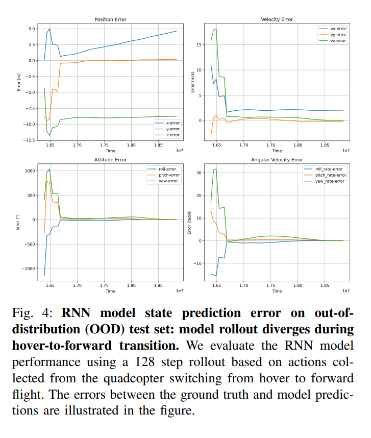
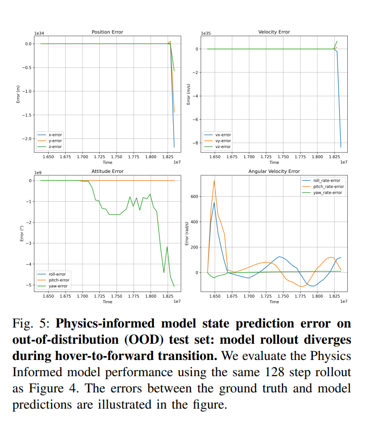

# DreamingFalcon: Real-Time Model-Based Reinforcement Learning for Quadrotor Control

## Design Document

---

## 1. Executive Summary

<!-- 2-3 sentences: What is this project? What problem does it solve? What's the key innovation? -->

In this project, we explored physics-constrained approach to model-based reinforcement learning for low-level quadcopter control. We hypothesized that this approach to allow for a generalizable policy that could adapt to drone configuration and environmental changes. We learned that learning a dynamics model online quickly (from <1 minute of flight data) is incredibly challenging because the model cannot learn holistic trends from a limited data set. 

---

## 2. Problem Statement

### 2.1 Motivation
<!-- Why is learning-based control for drones interesting/important? -->
Current control algorithms for aerial robots struggle with robustness in dynamic environments and adverse conditions. Model-based reinforcement learning (RL) has shown strong potential in handling these challenges while remaining sample-efficient. Additionally, Dreamer has demonstrated that online model-based RL can be achieved using a recurrent world model trained on replay buffer data. However, applying Dreamer to aerial systems has been quite challenging due to its sample inefficiency and poor generalization of dynamics models.

### 2.2 Challenges
<!-- What makes real-time MBRL on physical hardware hard? -->
The main challenge of online dynamics learning is that extrapolating from limited flight data is difficult. Small prediction errors due to out-of-distribution inputs leads to rapid compounding under RK4 integration. Since the policy optimization relies on imagined rollouts, the policy learning becomes unstable and fails to converge.
---

## 3. System Architecture

### 3.1 High-Level Design

```
┌─────────────────────────────────────────────────────────────────────────────┐
│                              Companion Computer                             │
│                                                                             │
│  ┌─────────────────────────────────┐    ┌─────────────────────────────────┐ │
│  │       Main Process (ROS)        │    │       Training Process          │ │
│  │                                 │    │                                 │ │
│  │  ┌───────────────────────────┐  │    │  ┌───────────────────────────┐  │ │
│  │  │      Storage Node         │  │    │  │        Learner            │  │ │
│  │  │                           │  │    │  │                           │  │ │
│  │  │  • Odometry subscriber    │  │    │  │  • World Model (MLP)      │  │ │
│  │  │  • Actuator subscriber    │  │    │  │  • RK4 Integrator         │  │ │
│  │  │  • Time synchronizer      │  │    │  │  • Actor-Critic           │  │ │
│  │  │  • Actuator publisher     │  │    │  │  • Optimizers             │  │ │
│  │  │                           │  │    │  │                           │  │ │
│  │  └───────────┬───────────────┘  │    │  └─────────────┬─────────────┘  │ │
│  │              │                  │    │                │                │ │
│  │              ▼                  │    │                ▼                │ │
│  │  ┌───────────────────────────┐  │    │  ┌───────────────────────────┐  │ │
│  │  │    Actor (inference)      │◄─┼────┼──┤   Actor (shared params)   │  │ │
│  │  └───────────────────────────┘  │    │  └───────────────────────────┘  │ │
│  │                                 │    │                                 │ │
│  └────────────────┬────────────────┘    └────────────────┬────────────────┘ │
│                   │                                      │                  │
│                   │         Shared Memory (GPU)          │                  │
│                   │    ┌─────────────────────────┐       │                  │
│                   └───►│     Replay Buffer       │◄──────┘                  │
│                        │  • States [10000 x 12]  │                          │
│                        │  • Actions [10000 x 4]  │                          │
│                        │  • Timesteps [10000]    │                          │
│                        │  • Circular pointer     │                          │
│                        │  • Mutex lock           │                          │
│                        └─────────────────────────┘                          │
│                                                                             │
└─────────────────────────────────────────────────────────────────────────────┘
                                      │
                                      │ ROS 2 / DDS
                                      ▼
┌─────────────────────────────────────────────────────────────────────────────┐
│                           PX4 Flight Controller                             │
│                                                                             │
│   VehicleOdometry ──────────────────────────────────► ActuatorMotors        │
│   (position, velocity,                                (motor commands)      │
│    quaternion, angular rates)                                               │
│                                                                             │
└─────────────────────────────────────────────────────────────────────────────┘
                                      │
                                      ▼
                              ┌───────────────┐
                              │   Quadrotor   │
                              └───────────────┘
```

**Components:**

| Component | Responsibility |
|-----------|----------------|
| **Storage Node** | ROS2 node that subscribes to drone telemetry, stores transitions in buffer, publishes actions |
| **Replay Buffer** | Circular buffer with shared memory tensors for cross-process data sharing |
| **Learner** | Trains world model and actor-critic policy from buffer samples |
| **Actor** | Stochastic policy network with shared parameters between processes |
| **World Model** | Physics-informed MLP that predicts forces/moments, integrated via RK4 |

### 3.2 Data Flow

```
  SENSOR DATA                    LEARNING                         CONTROL
  ──────────                     ────────                         ───────

  VehicleOdometry ─┐
  (50 Hz)          │
                   ├─► TimeSynchronizer ─► data_callback() ─┬─► ReplayBuffer.add()
  ActuatorOutputs ─┘       (±50ms)              │           │      (lock)
  (50 Hz)                                       │           │
                                                │           │
                                                ▼           │
                                        Parse & Normalize   │
                                        • quat → euler      │
                                        • NED velocity      │
                                        • yaw unwrapping    │
                                                            │
                                                            ▼
  ┌─────────────────────────────────────────────────────────────────────────┐
  │                         Replay Buffer (Shared Memory)                   │
  │                                                                         │
  │   states:  [..., s_t-2, s_t-1, s_t, _, _, ...]  ◄─── ptr                │
  │   actions: [..., a_t-2, a_t-1, a_t, _, _, ...]                          │
  │   dts:     [..., dt,    dt,    dt,  _, _, ...]                          │
  │                                                                         │
  └──────────────────────────────┬──────────────────────────────────────────┘
                                 │
                                 ▼
                    ReplayBuffer.sample(batch=64, seq_len=8)
                                 │
                ┌────────────────┴────────────────┐
                ▼                                 ▼
        World Model Training              Behavior Learning
                │                                 │
                ▼                                 ▼
        ┌───────────────┐                ┌───────────────────┐
        │ MLP predicts  │                │ Actor samples     │
        │ forces/moments│                │ action from state │
        └───────┬───────┘                └─────────┬─────────┘
                │                                  │
                ▼                                  ▼
        ┌───────────────┐                ┌───────────────────┐
        │ RK4 integrates│                │ World model       │
        │ to next state │                │ imagined rollout  │
        └───────┬───────┘                └─────────┬─────────┘
                │                                  │
                ▼                                  ▼
        ┌───────────────┐                ┌───────────────────┐
        │ Huber loss vs │                │ TD(λ) returns     │
        │ ground truth  │                │ + policy gradient │
        └───────┬───────┘                └─────────┬─────────┘
                │                                  │
                └─────────────┬────────────────────┘
                              ▼
                      Gradient Updates
                      (Adam optimizer)
                              │
                              ▼
                  Actor parameters updated
                  (shared across processes)
                              │
                              ▼
  ┌───────────────────────────────────────────────────────────────────────┐
  │                        Control Loop (10 Hz)                           │
  │                                                                       │
  │   state ──► Actor.forward() ──► tanh(action) ──► ActuatorMotors msg   │
  │                  (locked)                              │              │
  └────────────────────────────────────────────────────────┼──────────────┘
                                                           │
                                                           ▼
                                                    PX4 / Drone
```

**State Vector (12D):**
| Index | Component | Frame |
|-------|-----------|-------|
| 0-2 | Position (x, y, z) | NED Earth |
| 3-5 | Velocity (u, v, w) | Body |
| 6-8 | Attitude (φ, θ, ψ) | Euler |
| 9-11 | Angular rate (p, q, r) | Body |

**Action Vector (4D):** Normalized motor commands [0, 1]

---

## 4. Technical Decisions & Rationale

### 4.1 First 1-minute of Chirp

The initial chirp excitation serves to populate the replay buffer with diverse, informative data before policy learning begins. Chirp signals sweep through a range of frequencies, exciting the drone's dynamics across multiple timescales—from slow position changes to fast angular accelerations. This broad frequency content is critical: step inputs only capture transient responses, while steady-state flight produces nearly constant accelerations. Without sufficient spectral coverage in the training data, the world model fails to generalize to the full range of dynamics encountered during flight.

### 4.2 Physics-Informed World Model (6-DOF Rigid Body Dynamics)

Rather than learning a black-box state-to-state mapping, the network only predicts forces and moments—the physics engine handles the rest. This factorization reduces what the network must learn: instead of discovering that position integrates from velocity (which it would need to infer from data), the RK4 integrator encodes this structure explicitly. The hypothesis was that this inductive bias would improve sample efficiency and extrapolation. In practice, the model fit training data well, but generalization remained a challenge.

### 4.3 Multi-Process Architecture with Shared Memory

Training and data collection run in separate processes to avoid blocking the 10 Hz control loop. We chose shared memory (`torch.Tensor.share_memory_()`) over ROS topics for the replay buffer because: (1) zero-copy access—both processes read/write the same GPU tensors without serialization, and (2) lower latency—ROS message passing would add overhead from marshalling state vectors at 50 Hz. A mutex lock protects concurrent access to the circular buffer pointer.

### 4.4 Circular Replay Buffer Design

A circular buffer was chosen over a growing buffer for two reasons: (1) fixed memory footprint—important when running on embedded hardware with limited RAM, and (2) recency bias—older data becomes less relevant as the drone's behavior evolves, so overwriting stale transitions naturally prioritizes recent experience. The buffer also stores contiguous sequences (not just individual transitions) to support multi-step rollout training.

### 4.5 Online Normalization Strategy

State and action values span vastly different ranges (position in meters, angular rates in rad/s, motor commands in PWM units). Without normalization, the network would be dominated by large-magnitude features. We use a two-stage approach: (1) min-max normalization on insertion using known physical bounds (e.g., velocity ±10 m/s), and (2) optional z-score normalization computed from buffer statistics. The first stage ensures immediate usability; the second adapts to the actual data distribution as it accumulates.

---

## 5. Implementation Details

### 5.1 World Model

The world model predicts state transitions by learning the forces and moments acting on the quadcopter, then integrating through known physics.

**Architecture:**
```
Input: [action (4D), velocity (3D), attitude (3D), angular rate (3D)] → 13D
    ↓
Linear(13, 512) → ReLU → Dropout(0.1)
    ↓
Linear(512, 512) → ReLU → Dropout(0.1)
    ↓
Linear(512, 6) → Tanh
    ↓
Output: [Fx, Fy, Fz, Mx, My, Mz] (normalized)
```

**Physics Integration (RK4):**

The MLP outputs are denormalized to physical force/moment ranges, then passed through a 4th-order Runge-Kutta integrator that implements 6-DOF rigid body dynamics:

```
Position:      ẋ = DCM(φ,θ,ψ) · V_body
Velocity:      V̇ = F/m - ω × V
Attitude:      Θ̇ = J(φ,θ) · ω
Angular rate:  ω̇ = I⁻¹(M - ω × Iω)
```

Where:
- DCM is the direction cosine matrix (body → earth frame)
- J is the Euler angle kinematic matrix
- I is the inertia tensor (configured per drone)

**Loss Function:**

Weighted Huber loss with state-dependent importance:

| State Component | Weight | Rationale |
|-----------------|--------|-----------|
| Position (x,y,z) | 0.1 | Accumulates from velocity; less direct |
| Velocity (u,v,w) | 0.1 | Important but less critical than attitude |
| Attitude (φ,θ,ψ) | 1.0 | Critical for stability |
| Angular rate (p,q,r) | 5.0 | Most sensitive; errors here diverge fastest |

### 5.2 Actor-Critic Policy

**Actor Architecture:**
```
Input: state (12D)
    ↓
Linear(12, 256) → ReLU
    ↓
Linear(256, 4) → μ (mean)
    ↓
Sample from N(μ, σ=0.6)
    ↓
Tanh squashing → action ∈ [-1, 1]⁴
```

The actor uses the reparameterization trick for differentiable sampling. Log probabilities include the Jacobian correction for the tanh transform.

**Critic Architecture:**
```
Input: state (12D)
    ↓
Linear(12, 256) → ReLU
    ↓
Linear(256, 1) → V(s)
```

**TD(λ) Value Estimation:**

Returns are computed via λ-weighted bootstrapping over imagined rollouts:

```
V_λ(s_t) = r_t + γ[(1-λ)V(s_{t+1}) + λ·V_λ(s_{t+1})]
```

With γ = 0.95, λ = 0.95. Target critic is hard-updated every 100 iterations.

**Policy Gradient:**

```
L_actor = -𝔼[Σ_t log π(a_t|s_t) · (V_λ(s_t) - V(s_t))] + ν·𝔼[Σ_t log π]
```

Where ν = 0.00001 is the entropy penalty coefficient.

### 5.3 Reward Design

The reward function balances velocity tracking, energy efficiency, and stability:

```
r(s, a) = -(w_v · ‖v - v_target‖² + w_e · Σa_i + w_s · ‖ω - ω_target‖²)
```

| Term | Weight | Purpose |
|------|--------|---------|
| Velocity error | 0.01 | Track desired velocity |
| Control effort | 0.001 | Penalize excessive motor commands |
| Angular rate error | 0.001 | Encourage smooth, stable flight |

**Continue Mask:**

Rollouts are masked when states exceed safety thresholds to prevent learning from unstable trajectories:

| State | Threshold |
|-------|-----------|
| Position | ±100 m |
| Velocity | ±30 m/s |
| Roll/Pitch | ±1.5 rad |
| Yaw | ±6.0 rad |
| Angular rate | ±2.0 rad/s |

---

## 6. Experiments & Results

### 6.1 Experimental Setup

**Training Phase:**
- 100 seconds of chirp excitation with velocity trim to populate replay buffer
- 10 minutes of world model training on collected data
- Validation on 128-step rollouts sampled from the replay buffer

**Test Phase:**
- Out-of-distribution trajectory: hover-to-forward flight transition
- 50-step rollouts at 20 Hz (2.5 seconds)

### 6.2 In-Distribution Validation (Replay Buffer)

Both models achieved reasonable RMSE on data sampled from the training distribution:

| Model | Position (m) | Velocity (m/s) | Attitude (rad) | Angular Rate (rad/s) |
|-------|--------------|----------------|----------------|----------------------|
| **Physics-Informed** | 0.215 | 0.276 | 0.126 | 0.226 |
| **RNN Baseline** | 0.051 | 0.064 | 0.168 | 0.344 |

The RNN showed lower position/velocity error, while the physics-informed model performed better on attitude and angular rate—the states most critical for stability.

<!-- TODO: Add figure showing ID validation rollout comparison -->

### 6.3 Out-of-Distribution Test (Hover → Forward Flight)

When evaluated on trajectories outside the training distribution, both models failed to generalize:




**Key observation:** Both models fit the training data well but diverged rapidly on the test set. The physics-informed model's predictions became unstable within the first ~1 second of the rollout, preventing policy learning from converging.

**Root cause:** The chirp excitation, while spectrally rich, did not adequately cover the transition dynamics between operating regimes (e.g., hover → cruise). The replay buffer contained insufficient examples of these regime changes, causing both models to extrapolate poorly.

---

## 7. Lessons Learned

### 7.1 What Worked Well
<!-- Key successes and why -->
The overall architecture worked very well. There was minimal latency for the data to load into the replay buffer. There wasn't any hold up in loading data into GPU memory for the model training due to the efficient architecure design for the replay buffer.

### 7.2 What Didn't Work
<!-- Failures, debugging stories, things you'd do differently -->
If I were to start over, I would have built my own light weight simulator and prove that the code works on that before moving into the gazebo environment, because debugging on the full software stack was very challenging and compute intensive.

Secondly, for debugging, I should have leveraged rosbags more for debugging the system. I mostly relied on running the code in realtime (whether in the simulation or on the real drone) which always presented surprise challenges.

---

## 8. Future Directions

<!-- Where could this go next? Sim-to-real, multi-task learning, scaling, etc. -->
Future directions for this project is trying the same approach for offline learning. We could train a proxy model at scale from simulation data on HPC clusters, and then fine-tune the policy on real-life data to get around the data scarcity problem. Through this experiment, we can see if the inclusion of the 6DOF prior makes learning more efficient or not.

---

## 9. References

PIMBRL: https://arxiv.org/abs/2212.02179

Dreamerv3: https://arxiv.org/abs/2301.04104

---
